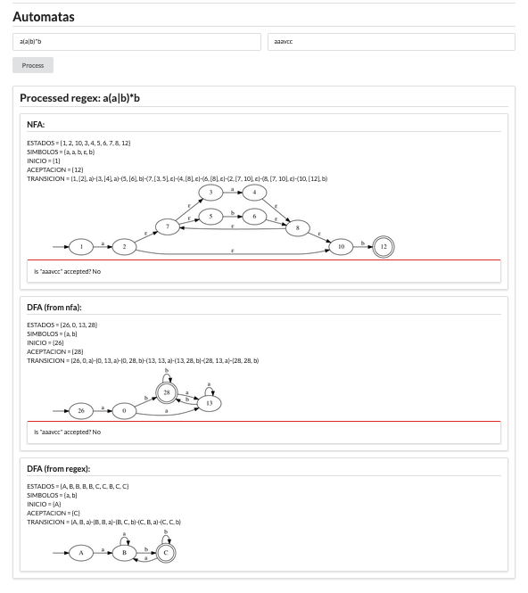
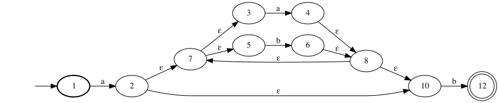
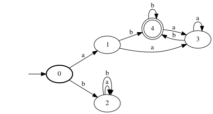

# Automata

[](https://travis-ci.com/jdvalenzuelah/automata)

## Docs

## Architecture

## Requirements
### Install Java SDK 11
- Use [sdkman](http://sdkman.io/)
```sh
$ curl -s "https://get.sdkman.io" | bash
$ source "$HOME/.sdkman/bin/sdkman-init.sh"
$ sdk version
$ sdk install java
```

### Install Gradle 5.3 or higher
```sh
$ sdk update
$ sdk install gradle
```

## Usage
```sh
$ git clone https://github.com/jdvalenzuelah/automata.git ${YOUR_PROJECT_NAME}
$ cd ${YOUR_PROJECT_NAME}
$ ./gradlew clean build
```

### To use web ui to generate nfa, dfa and test regex
Extract the dist
```sh
$ tar -xf build/distributions/kotlin-based-compiler-1.0.0.tar
```
Run compiled
```sh
$ ./kotlin-based-compiler-1.0.0/bin/kotlin-based-compiler
```

Server will be listening on `http://localhost:8080/`



logs will be saved to `kotlin-based-compiler.log`

### cli tool usage to generate nfa, dfa and test regex

run passing regex and destination path
```sh
$ ./kotlin-based-compiler-1.0.0/bin/kotlin-based-compiler -e "a(a|b)*b" -o ~/Desktop/regex.png
```
by default, it will generate a nfa:



to generate a dfa pass `--dfa` option
```sh
$ ./kotlin-based-compiler-1.0.0/bin/kotlin-based-compiler -e "a(a|b)*b" -o ~/Desktop/regex2.png --dfa
```

by default dfa is built using subset construction. To use direct parsing pass `--direct` option
```shell
$ ./kotlin-based-compiler-1.0.0/bin/kotlin-based-compiler -e "a(a|b)*b" -o ~/Desktop/regex2.png --dfa --direct
```



to export generated automata to txt file use `--export` option

```sh
$ ./kotlin-based-compiler-1.0.0/bin/kotlin-based-compiler -e "a(a|b)*b" -o ~/Desktop/regex2.png --dfa --export dfa.txt
```

to simulate automata using a string use option `--test`

```sh
$ ./kotlin-based-compiler-1.0.0/bin/kotlin-based-compiler -e "a(a|b)*b" --test aaaab
```
