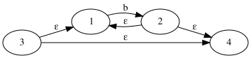

# Automata

[](https://travis-ci.com/jdvalenzuelah/automata)

## Docs

## Architecture

## Requirements
### Install Java SDK 11
- Use [sdkman](http://sdkman.io/)
```sh
$ curl -s "https://get.sdkman.io" | bash
$ source "$HOME/.sdkman/bin/sdkman-init.sh"
$ sdk version
$ sdk install java
```

### Install Gradle 5.3 or higher
```sh
$ sdk update
$ sdk install gradle
```

## Usage
```sh
$ git clone https://github.com/jdvalenzuelah/automata.git ${YOUR_PROJECT_NAME}
$ cd ${YOUR_PROJECT_NAME}
$ ./gradlew clean build
```

### To generate a graph from a regex expresion
Extract the dist
```sh
$ tar -xf build/distributions/kotlin-based-compiler-1.0.0.tar
```
run passing regex and destination path
```sh
$ ./kotlin-based-compiler-1.0.0/bin/kotlin-based-compiler -e 'b*' -o ~/Desktop/closure.png
```

closure.png:




